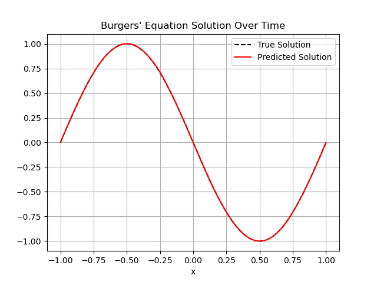
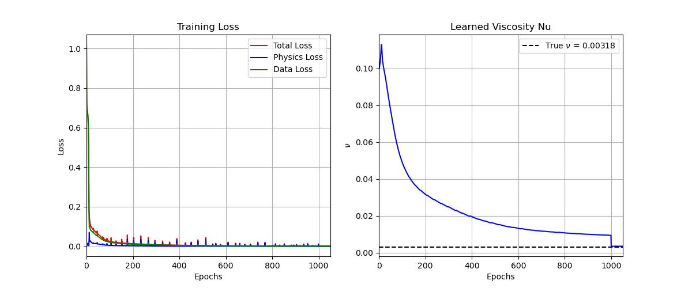

# Burgers' Equation with PINNs
This folder contains an implementation of a Physics-Informed Neural Network (PINN) to solve Burgers' equation, a fundamental partial differential equation in fluid mechanics. The implementation is based on the work by Raissi et al. (2019) and serves as a practical example of how PINNs can be used to solve PDEs.

## Burgers' Equation
Burgers' equation is given by:
\[
u_t + u u_x = \nu u_{xx}
\]
where $u$ is the velocity field, $t$ is time, $x$ is the spatial coordinate, and $\nu$ is the viscosity. This equation models various physical phenomena, including shock waves and turbulence. 
The initial conditions are given by the Dirichlet boundary conditions:
\[
u(0, t) = u(1, t) = 0
\]
and the initial condition:
\[
u(x, 0) = -\sin(\pi x)
\]
The domain for $x$ is $[-1, 1]$ and for $t$ is $[0, 1]$. The viscosity $\nu$ is set to $0.01 / \pi$, which we will later try to learn from the data.

## Implementation
The implementation consists of the following steps:
1. **Data Generation**: We use the data by "Raissi et al. (2019)" which contains the solution of Burgers' equation for the given initial and boundary conditions. For the initial condition, we take random points from the spatial domain at $t=0$. For the boundary conditions, we take random points from the spatial domain at $t=0$ and $t=1$. For the collocation points, we take random points from the entire spatio-temporal domain. For the inverse problem, we take random points from the entire spatio-temporal domain to learn the viscosity $\nu$.
2. **PINN Architecture**: We define a neural network architecture that takes as input the spatial and temporal coordinates and outputs the velocity field $u$. The NN consists out of $4$ hidden layers with $64$ neurons each and the activation function is the hyperbolic tangent (tanh).
3. **Loss Function**: The loss function consists of four components:
    - Initial condition loss: Mean squared error between the predicted and true values of $u$ at $t=0$.
    - Boundary condition loss: Mean squared error between the predicted and true values of $u$ at $x=-1$ and $x=1$.
    - PDE residual loss: Mean squared error of the residual of Burgers' equation at the collocation points.
    - Inverse problem loss: Mean squared error between the predicted and true values of $u$ at the points used for learning the viscosity $\nu$.
4. **Training**: We train the PINN using the Adam optimizer for a certain number of iterations. Afterwards, we switch to the L-BFGS optimizer for further fine-tuning. During training, we monitor the loss and the predicted solution to ensure that the PINN is learning the correct dynamics of Burgers' equation.
5. **Evaluation**: After training, we evaluate the performance of the PINN by comparing the predicted solution with the true solution and by checking the learned viscosity $\nu$ against the true value.

## Results
The PINN is able to learn the underlying physics of Burgers' equation and can predict the solution accurately, even with noisy data. The learned viscosity $\nu$ is also close to the true value, demonstrating the effectiveness of PINNs in solving inverse problems.

The following plot shows the training loss over iterations and the evolution of $\nu$ during training:
