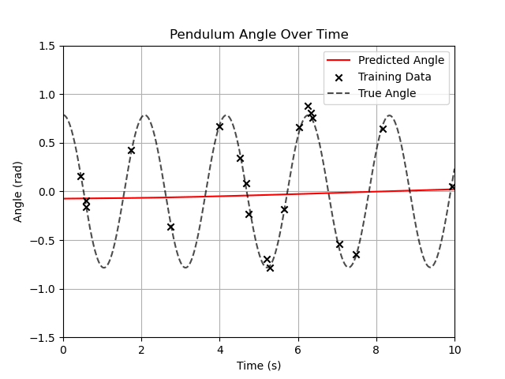

# Physics-Informed Neural Networks (PINNs)
This repository contains implementations of Physics-Informed Neural Networks (PINNs) for solving differential equations. It functions as a first personal test and exploration of the concept for me.

## Goals
- [ ] Get a basic understanding of PINNs and their applications.
- [ ] Implement a simple PINN to solve a basic differential equation.
- [ ] Explore more complex problems and applications of PINNs in the future.

## PINNs Overview
Physics-Informed Neural Networks (PINNs) are a class of neural networks that incorporate physical laws into the training process. They are designed to solve differential equations by minimizing a loss function that includes both data fitting and the residual of the differential equation.
### Advantages of PINNs
- Can solve complex differential equations without the need for mesh generation.
- Can handle noisy data and lack of data.
### Examples of Applications
My first implementation is a PINN for solving the pendulum. First, I generate some data by solving the pendulum equation using a numerical method, pick $20$ random points from the generated data, and add some noise to it to simulate real-world sensor data. Then, I train a neural network to learn the underlying physics of the pendulum motion by minimizing the loss function that includes both the data fitting and the residual of the pendulum equation. 

We can see that the PINN is able to learn the underlying physics of the pendulum motion and can predict the future states of the pendulum accurately, even with noisy data. If we remove the physical loss from the training process, the neural network struggles to learn the correct dynamics of the pendulum, resulting in overfitting to the noisy data.

This demonstrates the importance of incorporating physical laws into the training process of neural networks, especially when dealing with noisy data or limited data. 